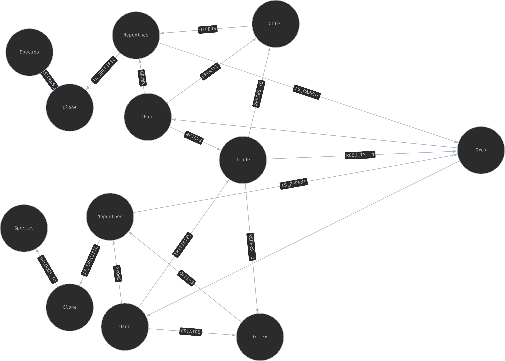

# Nepflow

## Introduction
Nepenthes are carnivorous plants that have found a steadily growing following in recent years, although some species can reach prices of over €100. There are numerous sources for information and pictures of different species.

[Tom's Carnivores](https://tomscarnivores.com/resources/nepenthes-interactive-guide/) offers a function to determine the climatic requirements of different species. [Marcellocatalano](https://www.marcellocatalano.com/aaa.htm)provides a code database that lists the different cloning variants of Borneo Exotics. [Cpphotofinder](https://cpphotofinder.com/Nepenthes.html)
presents an extensive picture gallery that allows you to view pictures of different species and hybrids.
The GFP (Society for Carnivorous Plants) maintains a special [subforum](https://forum.carnivoren.org/forums/forum/132-pollen/)
in their forum, which is used to find crossing partners for Nepenthes. In addition to GFP, there are various [groups](https://www.facebook.com/groups/1615538418599583?_rdr) on Facebook dedicated to the exchange of pollen providers and seekers.

## Motivation
In addition to the wealth of websites offering special features for Nepenthes and the ever-growing number of stores stocking these plants, the increasing variety of hybrid plants being bred underlines the fact that this hobby is in a golden age. However, one problem that currently arises from the many crosses and hybrids is that over time it becomes increasingly difficult to trace the lineage of one's own plant. Nepflow aims to help tackle this challenge. As a first step, Nepflow will function as a kind of pollen exchange platform. Users can register on the website and add their Nepenthes. On the basis of filterable attributes such as "flowering" or "soon to flower", it will then be possible to offer pollen (male) or flowers (female) of a Nepenthes in order to create a pollen exchange platform. Based on this idea, users are also given the opportunity to reference or add the parents of their plants, if known. By referencing, collecting and storing this information, users will be able to view the family tree of their own plants in the future.

## Key Tasks and Questions Nepflow aims to answer
While the Main Focus in on the Pollen Exchange, Nepflow and the underlying Datamodel aims to answer the following questions (the list is not exhaustive):
1. what is the family tree of a Nepenthes
2  How often does a particular Nepenthes flower on a particular person?
3. which Nepenthes are crossed particularly frequently?
4. what is the crossing success rate of a user?
5. are there Nepenthes that are sterile or rarely bear seeds?
6. which clone of a Nepenthes is particularly popular

## Future Technology Stack
- Java Spring Boot
- Angular 
- OpenAPI
- Neo4j 

## Current Datamodel
The data model to be developed is still in the modeling phase, but the following data model is currently being worked on

